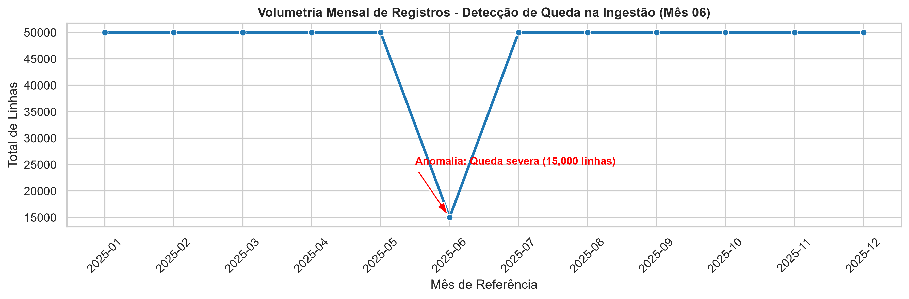
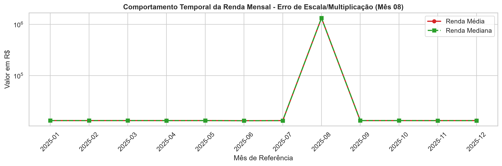

# Auditoria de Qualidade de Dados (Data Quality Audit) — Abordagem Top-Down

Este projeto aplica um framework de **Saneamento, Validação e Governança de Dados** sobre uma série temporal de 12 meses de bases de dados financeiras com anomalias sintéticas.

## 📌 Abordagem e Metodologia (Top-Down)
1. **Nível 1 & 2 (Análise Macro):** Inspeção de volumetria e distribuição temporal por lotes para identificação de falhas de ingestão e escala.
2. **Nível 3 (Amostragem & Validação Micro):** Aplicação de amostragem estatística estratificada e validação sintática (algoritmo real de verificação de CPF e consistência temporal de renda/idade).
3. **Nível 4 (Segregação & Imputação Lógica):** Recuperação de registros via histórico temporal e segregação final nas camadas **Gold**, **Silver (Imputados)** e **Quarantine**.

---

## 📈 Diagnóstico Visual (Análise Macro)

### 1. Detecção de Queda de Ingestão (Volumetria Mensal)

### 2. Identificação de Erro de Escala e Moeda (Distribuição de Renda)

---

## 📊 Resultados e Matriz Executiva de Data Quality

Após o diagnóstico macro/micro e a aplicação da amostragem estatística, as regras foram executadas de forma vetorizada sobre a base temporal inteira. Os registros foram segregados conforme as políticas de governança:

| Camada (Base) | Status do Registro | Critério de Elegibilidade / Regra | Volumetria (Linhas) | Percentual (%) |
| :--- | :--- | :--- | :---: | :---: |
| **Gold** | Íntegro de Origem | Registros com CPF válido e sem nenhuma anomalia detectada. | 492.615 | 87,19% |
| **Imputed (Silver)** | Recuperado via Histórico | CPF válido, mas com correção de escala de renda (Mês 08) ou imputação de idade via mediana temporal (Mês 11). | 55.741 | 9,87% |
| **Quarantine** | Invalidador/Isolado | Registros com dígitos verificadores de CPF matematicamente incorretos. | 16.644 | 2,95% |
| **TOTAL** | **Processado** | **Aproveitamento Efetivo da Base: 97,05%** | **565.000** | **100,00%** |

> ⏱️ **Eficiência de Processamento:** Validação, recuperação e gravação em Parquet concluídas em **5,69 segundos**.

---

## 📁 Estrutura dos Arquivos Gerados (`data/processed/`)

O pipeline exporta automaticamente os seguintes artefatos após a execução:

* `base_gold.parquet`: Registros 100% limpos e aptos para consumo analítico e modelagem de ML.
* `base_imputed.parquet`: Registros com correções lógicas aplicadas e histórico rastreável (Camada Silver).
* `base_quarantine.parquet`: Registros com inconsistências críticas de CPF isolados para auditoria da origem.
* `audit_sample_results.csv`: Amostra estatística com flags detalhados de validação sintática e temporal.
* `metrics_summary.md` e `metrics_json`: Consolidado de estatísticas e percentuais de aproveitamento para integração contínua (CI/CD) e dashboards.

---

## 🛠️ Tecnologias Utilizadas
- **Linguagem & Bibliotecas:** Python 3.10+, Pandas, NumPy, Seaborn, Matplotlib, Faker
- **Armazenamento de Alta Performance:** PyArrow (Formato Parquet)
- **Controle de Versão & Automação:** Git, GitHub